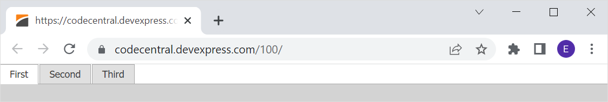

# Page Control for ASP.NET Web Forms - How to display the page control in full screen mode (100% width and height)
<!-- run online -->
**[[Run Online]](https://codecentral.devexpress.com/100/)**
<!-- run online end -->

This example demonstrates how to adjust the size of the page control to the size of the browser window.



## Overview

Set the `body` element's paddings and margins to `zero`.

```css
body, html {
    padding: 0;
    margin: 0;
}
```

Set the control's [Width](https://docs.devexpress.com/AspNet/DevExpress.Web.ASPxWebControl.Width) property to `100%` and specify the control's initial [height](https://docs.devexpress.com/AspNet/DevExpress.Web.ASPxWebControl.Height). Optionally, set the control's [Paddings.Padding](https://docs.devexpress.com/AspNet/DevExpress.Web.Paddings.Padding) property to `0px` to disable default offsets and paddings.

```aspx
<dx:ASPxPageControl ID="pc" runat="server" Height="100px" Width="100%" ...>
    <Paddings Padding="0px" />
    <!-- ... -->
</dx:ASPxPageControl>
```

Create an function (**AdjustSize**) that resizes the page control within the entire browser window. Call this function in the following cases:

* The control is first initialized - handle the control's client-side `Init` event.
* The browser window size changes - call the client-side [AttachEventToElement](https://docs.devexpress.com/AspNet/js-ASPxClientUtils.AttachEventToElement.static(element-eventName-method)) method to handle the browser's `resize` event.


```aspx
<dx:ASPxPageControl ID="pc" runat="server" ... >
    <!--...-->
    <ClientSideEvents Init="OnInit" />
</dx:ASPxPageControl>
```

```js
function OnInit(s, e) {
    AdjustSize();
    ASPxClientUtils.AttachEventToElement(window, "resize", function(evt) {AdjustSize();});
}

function AdjustSize() {
    var height = document.documentElement.clientHeight;
    pc.SetHeight(height);
}
```

## Files to Review

* [Default.aspx](./CS/WebSite/Default.aspx) (VB: [Default.aspx](./VB/WebSite/Default.aspx))

## Documentation

* [Page Control](https://docs.devexpress.com/AspNet/DevExpress.Web.ASPxPageControl)

## More Examples

* [Grid View for ASP.NET Web Forms - How to display the Grid View in the full screen mode (100% width and height)](https://github.com/DevExpress-Examples/aspxgridview-full-screen-mode)
* [Splitter - Full Screen Mode](https://demos.devexpress.com/ASPxNavigationAndLayoutDemos/Splitter/FullscreenMode.aspx?device=tablet&rotate=0)
